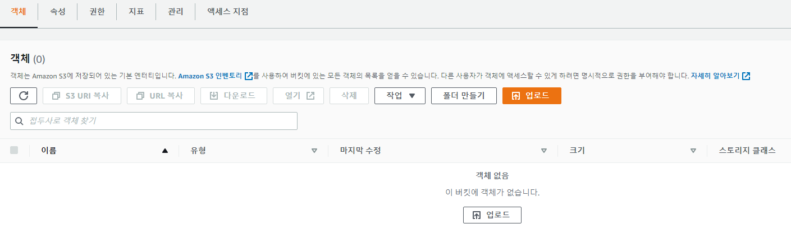

# tripleCMS
> 트리플 클럽 마일리지 서비스의 서버 애플리케이션 구현 프로젝트 입니다.

<br/>

## 1. 서비스 개요
트리플 사용자들이 장소에 리뷰를 작성할 때 포인트를 부여하고, 전체/개인에 대한 포인트 부여 히스토리와 개인별 누적 포인트를 관리하고자 합니다.

<br/>   

## 2. 서비스 주요기능
- 리뷰 작성 시 포인트 적립 및 회수
    1. 포인트 지급
        - 글만 있는 리뷰 작성하면 <b>1점</b> 적립
            - 1자 이상 텍스트 작성 : 1점
        - 글과 사진이 있는 리뷰 작성 <b>2점</b> 적립 
            - 1자 이상 텍스트 + 1장 이상 사진 : 2점
        - ~글만 있는 리뷰를 수정하여 사진을 추가할 시, 1점 추가 적립~ - 다시 확인해 보니 구현이 안 되어있습니다.
        - 리뷰가 없는 여행장소에 최초 리뷰 작성 시 <b>보너스 점수 1점</b> 추가 적립
            - 여행장소에 사용자 A가 최초리뷰 작성 후 삭제하고, 삭제된 이후 사용자 B가 리뷰를 작성하면 B에게 보너스 점수 부여
            - [trouble case] 사용자 A가 최초리뷰를 삭제하는데 <b>삭제되기 이전에 사용자 B가 리뷰를 작성하면</b> 최초리뷰로 인정되지 않고 보너스 점수가 부여 안됨
    2. 포인트 회수
        - 작성한 리뷰를 삭제하면, 해당 리뷰에 지급된 <b>모든 포인트</b> 회수
        - 글과 사진이 있는 리뷰에서 <b>사진을 모두 삭제</b>하면 <b>1점</b> 회수
    
<br/>

- 포인트 증감 이력 확인
    - 사용자는 현재 시점의 본인의 포인트 이력 및 총점을 조회할 수 있음

<br/>

- 포인트 별 레벨 구현
    - 레벨 승급 포인트 달성 시, 등급 업그레이드 및 포인트 회수로 인한 다운그레이드 기능 구현
    - 0 LEVEL : 5 포인트 미만
    - 1 LEVEL : 5 포인트
    - 2 LEVEL : 40 포인트
    - 3 LEVEL : 100 포인트

<br/>

## 3. 개발 요구사항
- SQL( MySQL >= 5.7) 스키마 설계
    - 테이블과 인덱스에 대한 DDL 필요
- REST API를 제공하는 서버 애플리케이션 구현

<br/>

## 4. 기술 스택
- Spring Boot (API Server)
- Spring Security (Security)
- MySQL(8.0 / AWS_RDS) (RDB)
- JPA (ORM)
- AWS EC2 (Infra)
- AWS S3 (Store)
- Postman(Documentation)
- DBeaver (Database tool)
- IntelliJ (Development tools)

<br/>

## 5. 가용 서버
- 13.125.166.209:8080
    - 위 서버로 테스트 진행해주시면 됩니다..!

<br/>

## 6. 기능 및 사용방법

<br/>
🔍 회원가입 및 로그인

> * 13.125.166.209:8080/api/sign/** <- 토큰 없이도 사용가능합니다.

```bash 
Post
* 회원가입 : 13.125.166.209:8080/api/sign/register
* 로그인 : 13.125.166.209:8080/api/sign/login
* 엑세스 토큰 유효시간 : 30분
* 재발행 토큰 유효기간 : 7일
{
    "userName" : "testda",
    "userPw" : "qwer1234"
}
```
<p align="center">


</p>

> * JWT 토큰을 통한 회원가입과 로그인을 구현하였습니다.
> * Response 값에 나와있는 access 토큰을 url에서 사용해주시면됩니다.

<br/>

🔍 토큰 재발행

```bash 
Post
* 토큰 재발행 : 13.125.166.209:8080/api/sign/register
{
    "accessToken" : "엑세스 토큰",
    "refreshToken" : "리프레시 토큰"
}
```

<p align="center">

</p>


> * 토큰 재발행 시, 이전 로그인할때 나온 Response 값(accessToken, refreshToken)으로 사용하시면 됩니다.

<br/>

🔍 엑세스 토큰 인증방법

```bash 
* 각 기능의 Headers 에서 Key값과 Value값을 넣어주세요
* key : X-AUTH-TOKEN
* value : access 토큰
```

<p align="center">

</p>


<br/>

🔍 내 회원정보 조회

```bash 
Get
* 로그인 Response 값에서 userID 값을 주소에 붙여주세요 
* 13.125.166.209:8080/api/sign/user/유저아이디
```

<p align="center">

</p>

> * userId / userName / point(보유포인트) / userLevel (유저레벨) 확인 할 수 있습니다.

<br/>

🔍 장소 등록 및 조회

```bash 
Post 
* 장소등록
* 로그인 Response 값에서 userID 값을 주소에 붙여주세요 
* 13.125.166.209:8080/api/place/add

{
    "placeName" : "장소명"
}

-------------------------------

Get
* 장소 전체 조회
* 13.125.166.209:8080/api/place

```
<p align="center">


</p>

> * 등록된 장소들의 placeId / placeName / placeReviewCount(등록 리뷰 수) 를 확인 할 수 있습니다.


<br/>

🔍 사진없는 리뷰 등록 및 포인트 적립 


```bash 
Post 
* 사진없는 리뷰 등록
* 13.125.166.209:8080/api/review/add

{
"type": "REVIEW",
"action": "ADD",
"content": "좋아요!!",
"attachedPhotoIds" : [],
"userId": "유저 아이디",
"placeId": "장소 아이디"
}

-------------------------------

Post
* 이벤트
* 13.125.166.209:8080/api/events

{
    "type": "REVIEW",
    "action": "ADD",
    "reviewId": "fefe829a-7c09-4f06-834e-b8e56f3341cc",
    "content": "좋아요!!",
    "attachedPhotoIds": [],
    "userId": "1393d411-7dc8-45c2-82fd-0810feeb66d3",
    "placeId": "952af4cc-468b-448a-92d5-fcbf11a2d7a7"
}

```

<p align="center">


</p>

> * 리뷰 등록 후 나오는 Response 값을 복사 후 그대로 복사 붙여넣으시면 됩니다.
> * 리뷰 등록 시 리뷰는 등록되고 포인트는 적립 되지 않습니다. 
> * 이벤트를 통해서 포인트가 적립됩니다.
> * 이벤트 Response 값을 통해 포인트 적립을 확인 할 수 있습니다.
> * 글 리뷰 1점 / 글 + 사진 리뷰 2점 / 여행장소 최초 리뷰 1점 추가

<br/>

🔍 이벤트 발생 이력 조회

```bash 
Get
* 13.125.166.209:8080/api/history/유저아이디

```

<p align="center">

</p>

> * 해당 유저의 이벤트 발생 이력을 확인 할 수 있습니다.
> * 포인트 증감치도 확인 할 수 있습니다.

<br/>

🔍 사진있는 리뷰 등록 및 S3업로드

```bash 
Post
* 13.125.166.209:8080/api/review/addAttPhoto
* form-data 를 사용했습니다.
* 이번 케이스는 사진으로 확인 부탁드립니다..!
* key : requestDto / 
* value : {
            "type": "REVIEW",
            "action": "ADD",
            "content": "좋아요!!",
            "userId": "유저 아이디",
            "placeId": "장소 아이디"
        }
* key : multipartFiles
* value : file 
(file 입력후, 버튼 누르면 탐색기창이 나옵니다, 여기서 한개 또는 여러개(ctrl키 누르고) 선택해주세요)

```

<p align="center">


</p>

> * 사진리뷰를 등록하면, 첨부사진의 S3에 업로드 됩니다.
> * 이전 이벤트 등록과 동일하게 Response 값 그대로 복사해서 붙여넣어 주세요..!
> * 마찬가지로, 이벤트 등록 후 Response 값에서 트랜잭션 내용을 확인 할 수 있습니다.

<br/>

🔍 등록한 리뷰 조회
```bash 
Get
* 13.125.166.209:8080/api/review/유저아이디

```

<p align="center">

</p>

> * 조회하면 해당 유저가 등록한 리뷰들을 확인 할 수 있습니다.

<br/>

🔍 등록한 리뷰 삭제
```bash 
Delete
* 13.125.166.209:8080/api/review/리뷰아이디

```

<p align="center">


</p>

> * 진행하면 리뷰가 삭제되면 올렸던 사진들도 모두 삭제되고 s3에도 반영됩니다.
> * 이것도 동일하게 이벤트에 복사 붙여넣기 해주세요.
> * 리뷰가 삭제될 시, 이 리뷰로 받은 포인트를 회수됩니다.

<br/>

🔍 등록한 리뷰 수정
```bash 
Put
* 13.125.166.209:8080/api/review/update
* 수정 기능은 미비한 부분으로, 기존 등록과 삭제와 다르게 진행해야합니다.
* 먼저, 유저의 리뷰를 조회 후 수정할 리뷰 값을 복사해주세요   (Get)(13.125.166.209:8080/api/review/유저아이디)
* 수정 URL에서 복사한 값을 붙여넣는데, 수정해야될 값 중에 "attachedPhotoIds" 값이 null 이라면, 아래 테스트케이스와 같이 "attachedPhotoIds" value 값을 바꾼뒤 진행해주세요.
* 수정 파트는 미완성으로, S3 과 연동이 안되서 사진추가도 할 수 없습니다..
* 다만, "[사진Id, 사진Id]" (문자열이라 대괄호옆 쌍따옴표 붙여주셔야 됩니다) 이런식으로는 변경 할 수 있습니다.

{
            "reviewId": "fefe829a-7c09-4f06-834e-b8e56f3341cc",
            "content": "좋아요!!",
            "attachedPhotoIds": "[]",
            "userId": "1393d411-7dc8-45c2-82fd-0810feeb66d3",
            "placeId": "952af4cc-468b-448a-92d5-fcbf11a2d7a7"
}

```

<p align="center">

</p>

> * 진행하면 리뷰가 수정되며, 마찬가지로 Response 값 복사 붙여넣기 하면 포인트 반영됩니다.


<br/>

## 7. DDL

<p align="center">

</p>

## 8. 패키지 구조

```bash 
├── config                      
|   ├── AwsConfig.class                       // Aws 버켓 설정 관련
|   └──	jwt							          // Jwt 관련
│       ├── JwtAuthenticationFilter.class     // Jwt Filter chain
│	    ├── JwtTokenProvider.class            // JwtTokenProvider
│	    ├── SecurityConfig.class              // Jwt Config
│	    ├── TripleUserDetails.class           // Custom UserDetails
│       └── TripleUserDetailsService.class    // Custom UserDetailsService
├── controller      
│	├── EventController.class			    // 이벤트 발생 관련 (포인트 처리)
│	├── ExceptionController.class 			// Exception 관련
│	├── HistoryController.class 			// 이벤트 발생 이력 관련
│	├── PlaceController.class				// 장소 관련
│	├── ReviewController.class 				// 리뷰 관련 
│   └── SingController.class 				// 유저와 로그인 및 회원가입 관련 
├── dto
│	├── requestDto                          
│   │   ├── events
│   │   │   └── EventReqeustDto.class
│   │   ├── jwt
│   │   │   └── TokenRequestDto.class
│   │   ├── place
│   │   │   └── PlaceAddRequestDto.class
│   │   ├── review
│   │   │   ├── ReviewAddRequestDto.class
│   │   │   └── ReviewUpdateRequestDto.class
│   │   └── user
│   │       ├── UserLoginRequestDto.class
│   │       └── UserRegisterRequestDto.class							
│	└── responseDto	
│       ├── events
│       │   └── EventResponseDto.class
│       ├── history
│       │   └── HistoryResponseDto.class
│       ├── jwt
│       │   └── TokenResponseDto.class
│       ├── place
│       │   ├── PlaceAddResponseDto.class
│       │   └── PlaceFindAllResponseDto.class
│       ├── review
│       │   ├── ReviewDeleteResponseDto.class
│       │   ├── ReviewGetResponseDto.class
│       │   ├── ReviewResponseDto.class                     // 리뷰 등록 Response DTO
│       │   └── ReviewUpdateResponseDto.class
│       └── user
│           ├── UserGetResponseDto.class
│           ├── UserLoginResponseDto.class
│           └── UserRegisterResponseDto.class
├──	exception					
│	├── advice
│	│   └── ExceptionAdvice				                    // custom exception 관련 설정
│	├── AuthenticationEntryPointException.class							
│	├── CustomAccessDeniedHandler.class 				      
│	├── CustomAuthenticationEntryPoint.class 				
│	├── InvalidRefreshTokenException.class					
│	├── LoginFailureException.class
│	├── PlaceAlreadyExistsException.class
│	├── PlaceNotFoundException.class
│	├── ReviewNotFoundException.class
│	├── UserIdAlreadyExistsException.class
│	├── UserNotFoundException.class
│	└──  WriterAlreadyExistsException.class
├── model								                    
│	├── enumPackage                                         // enum 패키지
│	│   ├── Action.enum
│	│   ├── Event.enum
│	│   └── Role.enum
│	├── Attphoto.class                                      // 리뷰 첨부사진 모델
│	├── History.class                                       // 이벤트 발생 이력 모델
│	├── Place.class                                         // 여행 장소 모델
│	├── Review.class                                        // 리뷰 모델
│   └── User.class                                          // 유저 모델
├── repository								
│	├── HistoryRepository.interface                         // History DAO
│	├── PhotoRepository.interface                           // Attphoto DAO
│	├── PlaceRepository.interface                           // Place DAO
│	├── ReviewRepository.interface                          // Review DAO
│   └── UserRepository.interface                            // User DAO
├── service						
│	├── EventService.class                                  // 이벤트 서비스
│	├── HistoryService.class                                // 이벤트 발생 이력 관련 서비스
│	├── PhotoService.class                                  // 첨부사진 관련 서비스
│	├── PlaceService.class                                  // 여행 장소 관련 서비스 
│	├── ResponseService.class                               // ResponseDto Result 관련 서비스 
│	├── ReviewService.class                                 // 리뷰 서비스
│	├── S3Service.class                                     // S3 관련 서비스
│	└── SignService.class                                   // 유저 관련 서비스
├── result
│	├── MultipleResult.class                                // 다중 결과 값 Result
│	├── Result.class
│	└── SingleResult.class                                  // 단일 결과 값 Result
│ 
```
